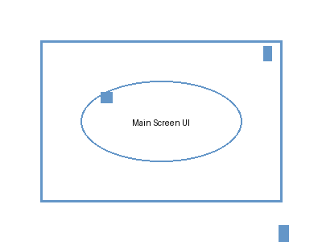

# Visual Regression Testing with Git LFS

A robust, LFS-aware GitHub Actions workflow system for visual regression testing. This system handles multiple output images, uses NVIDIA's flip for high-fidelity comparison, and correctly stores final "golden" images using Git LFS to avoid bloating the main repository.

## Features

- **LFS-Aware Storage**: Automatically handles large image files using Git LFS
- **High-Fidelity Comparison**: Uses NVIDIA flip for precise image comparison
- **Interactive Workflow**: Accept/reject changes via PR comments
- **Consolidated Reporting**: Single PR comment with all visual changes
- **Security**: Permission checks for image acceptance

## Prerequisites

The repository must be configured to use Git LFS for image file types:

```bash
# Install Git LFS
git lfs install

# Track image files (already configured in .gitattributes)
git lfs track "golden/**/*.png"
git lfs track "golden/**/*.jpg" 
git lfs track "golden/**/*.jpeg"
```

## Workflow Overview

### 1. Visual Diff and PR Report

**Trigger**: On every pull request

**Process**:
1. Runs your test suite to generate output images in `outputs/` directory
2. Compares each output against its golden master using NVIDIA flip
3. Generates visual diff images in `diffs/` directory  
4. Posts consolidated report as PR comment
5. Uploads artifacts for the acceptance workflow

**Example Output**:
```
🔄 **Changed Image:** `ui-main-screen.png`

| Difference | New Output |
|------------|------------|
|  |  |

To accept this change, comment: `/accept-image ui-main-screen.png`
```

### 2. Accept New Golden Image

**Trigger**: Comment `/accept-image <filename>` on PR

**Process**:
1. Validates commenter has write permissions
2. Downloads artifacts from visual diff workflow
3. Moves accepted image to `golden/` directory
4. Commits and pushes using Git LFS
5. Confirms acceptance via PR comment

## Usage

### Running Tests

The workflow automatically runs `generate_test_images.py` to create test outputs. Customize this script for your application:

```python
# Your test suite should populate outputs/ directory
def run_your_tests():
    # Generate screenshots, renders, etc.
    save_image("outputs/ui-component.png", your_image_data)
```

### Accepting Changes

When the workflow detects visual changes, comment on the PR:

```
/accept-image ui-main-screen.png
```

This will:
- Move the new image to `golden/ui-main-screen.png`
- Commit it with Git LFS
- Update the PR automatically

### Directory Structure

```
├── .gitattributes          # Git LFS configuration
├── .github/workflows/
│   ├── visual-diff.yml     # Main comparison workflow
│   └── accept-image.yml    # Image acceptance workflow
├── generate_test_images.py # Sample test script
├── outputs/                # Generated test images (temporary)
├── diffs/                  # Visual diff images (temporary)
└── golden/                 # Reference images (LFS tracked)
```

## Security

- Only users with write permissions can accept images
- All operations are logged and attributed
- Git LFS ensures large files don't bloat repository history

## Example Test Script

See `generate_test_images.py` for a sample implementation that creates test images with consistent, reproducible content.

## Troubleshooting

### Images Not Loading in PR Comments

The workflow now commits generated images temporarily to the repository and uses proper GitHub raw content URLs in PR comments. This ensures images display correctly without requiring external hosting.

**If images still don't display:**
1. Check if the "Commit images for PR display" step succeeded in the workflow logs
2. Verify the repository permissions allow the workflow to push commits
3. For private repositories, ensure raw.githubusercontent.com URLs are accessible
4. Download the workflow artifacts as a fallback to view images locally

**Error message:** "Visual differences detected but images could not be displayed"
- This indicates the commit step failed
- Check workflow logs for git push errors
- Verify branch protection rules allow automated commits
- Use the artifact download link provided in the comment

### Permission Denied on Accept

Ensure the user commenting has write access to the repository.

**Error message:** "does not have write permissions to accept images"
- Only repository collaborators with write or admin access can accept images
- Check repository settings → Manage access

### Workflow Not Triggering

Check that:
- The PR has changes that would generate new output images
- The `generate_test_images.py` script runs successfully
- Artifacts are being uploaded correctly

### Git LFS Issues

**Large repository size:**
- Ensure `.gitattributes` is configured correctly
- Verify LFS is tracking image files: `git lfs ls-files`
- Clean up old LFS objects: `git lfs prune`

**LFS file not found:**
- Run `git lfs pull` to download LFS files
- Check LFS quota in repository settings

### Debug Steps

1. **Check workflow logs** for detailed error messages
2. **Download artifacts** manually to verify image generation
3. **Test locally** by running `generate_test_images.py`
4. **Verify permissions** using repository settings
5. **Check branch protection** rules that might block automated commits
